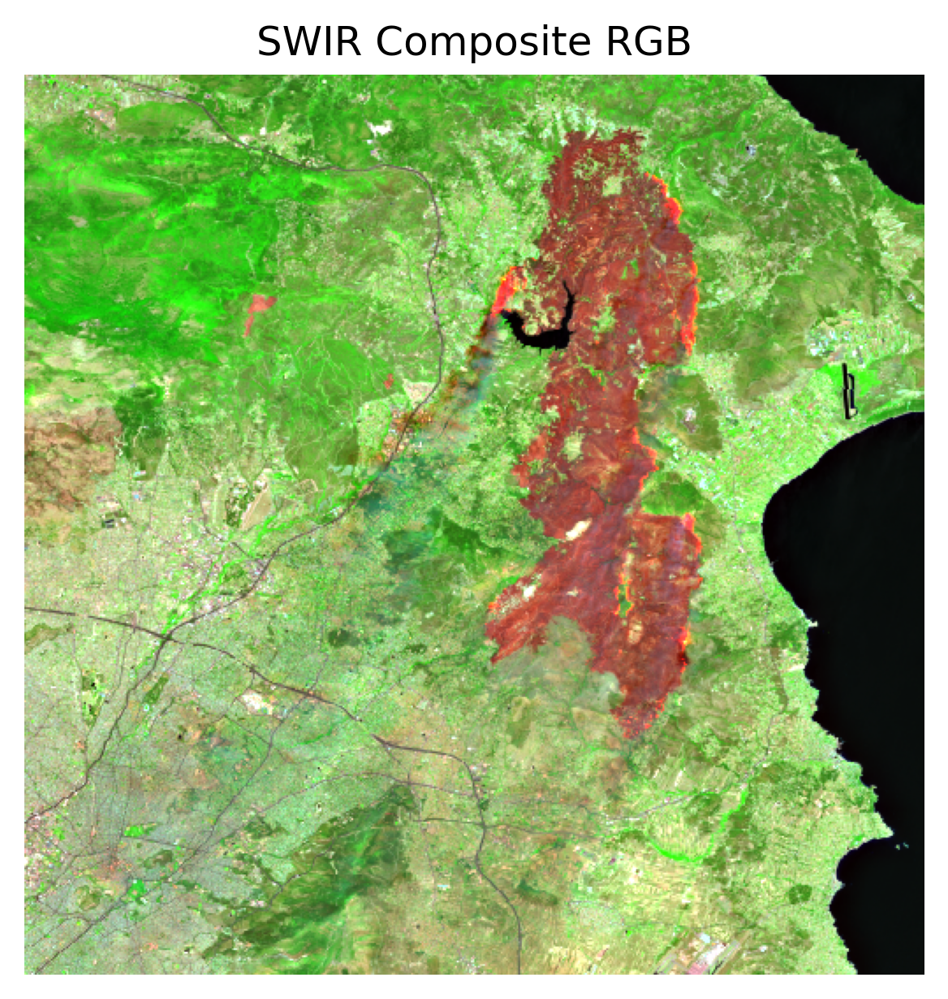

# SWIR Composite Image Retrieval for Wildfire Affected Areas using Sentinel Hub API

This project automates the process of retrieving SWIR (Short-Wave Infrared) composite RGB images from Sentinel-2 satellites using the Sentinel Hub API. It is designed to visualize and analyze the area impacted by the wildfires that occurred in the Attica region of Greece in August 2024. 

## Table of Contents
- [Introduction](#introduction)
- [Purpose](#purpose)
- [Installation](#installation)
- [Usage](#usage)
- [Area of Interest (AOI)](#area-of-interest-aoi)
- [Environment Variables](#environment-variables)
- [References](#references)
- [License](#license)

## Introduction

The SWIR composite is particularly useful for visualizing fire-affected areas because it highlights burned vegetation, soil moisture, and heat signatures in ways that traditional imagery cannot. This project retrieves the SWIR composite for the Attica region of Greece, which experienced devastating wildfires in August 2024.

## Purpose

This project demonstrates how to use Sentinel-2 satellite imagery and SWIR composites to assess environmental damage caused by wildfires. It retrieves the satellite image for the area of interest and the date of the wildfires, showcasing the burned land and active fire fronts during that time.

## Installation

### Prerequisites
- Python 3.x
- Sentinel Hub API account (you need to generate your Client ID and Client Secret)
- Required Python packages (`requests`, `dotenv`)

### Steps

1. **Clone the Repository**:
    ```bash
    git clone https://github.com/your-username/sentinel-swir-wildfire.git
    cd sentinel-swir-wildfire
    ```

2. **Install Required Dependencies**:
    Install the necessary Python libraries via pip:
    ```bash
    pip install -r requirements.txt
    ```

3. **Set Up Environment Variables**:
    You can store your API credentials in a `.env` file for security purposes:
    ```bash
    SENTINEL_CLIENT_ID=your_client_id
    SENTINEL_CLIENT_SECRET=your_client_secret
    ```

4. **Run the Script**:
    Execute the Python script to retrieve the SWIR composite image:
    ```bash
    python main.py
    ```

## Usage

The main use case of this project is to visualize fire-affected areas using the SWIR composite of Sentinel-2 imagery.

1. **Area of Interest (AOI)**: 
    The wildfire-affected region is located in the Attica region of Greece, and the script uses the following coordinates:
    ```json
    {
      "type": "Polygon",
      "coordinates": [
        [[23.694077, 37.942031], [23.694077, 38.262985], [24.043579, 38.262985], [24.043579, 37.942031], [23.694077, 37.942031]]
      ]
    }
    ```

2. **Date of Image Retrieval**: 
    The wildfire occurred in August 2024, and the image is retrieved for August 12, 2024.

3. **Output**: 
    The output SWIR composite image will be saved as `swir_composite.tiff` in the project directory.

## Area of Interest (AOI)

The wildfire that devastated the Attica region in August 2024 burned approximately 25,000 acres of land, as highlighted by Sentinel-2 imagery. This project uses the coordinates of the affected region to retrieve a SWIR composite that reveals critical details about the fire damage. 

### Articles Detailing the Wildfire:
- **"Wildfires in Greece have burned land twice the size of Manhattan, satellite images reveal"**  
  This article describes the scale of the wildfires that impacted Attica, Greece, and showcases how satellite imagery from Sentinel-2 was used to visualize the extent of the damage.  
  [Read more here](https://www.space.com/wildfires-greece-satellite-imagery)&#8203;:contentReference[oaicite:0]{index=0}

- **"High-resolution satellite image of the Barnabas forest fire"**  
  This article offers high-resolution satellite imagery of the Barnabas forest fire from the European Sentinel-2 satellite, depicting the vast area affected by the wildfire and the active fire fronts as of August 12, 2024.  
  [Read the full article](https://meteo.gr/article_view.cfm?entryID=3353)&#8203;:contentReference[oaicite:1]{index=1}

These references provide critical insight into the geographical extent and the environmental impact of the wildfire in the Attica region.

## Example Result

The following is the SWIR composite image of the wildfire-affected area in the Attica region, retrieved from Sentinel-2 satellite imagery:



This image was generated using the coordinates of the Attica region and demonstrates the affected area as captured by satellite on August 12, 2024.


## Environment Variables

Before running the script, ensure that the following environment variables are set either manually or by using a `.env` file:

- `SENTINEL_CLIENT_ID`: Your Sentinel Hub API Client ID
- `SENTINEL_CLIENT_SECRET`: Your Sentinel Hub API Client Secret

To load the environment variables from a `.env` file, use the `python-dotenv` library.

## References

- **[Sentinel Hub API Documentation](https://www.sentinel-hub.com/develop/documentation/)**  
  Official documentation for using the Sentinel Hub API.

- **Articles referenced for wildfire information**:
  - "Wildfires in Greece have burned land twice the size of Manhattan, satellite images reveal"  
    Published on Space.com, this article discusses the 2024 wildfires in the Attica region.  
    [Read the article](https://www.space.com/wildfires-greece-satellite-imagery)&#8203;
  
  - "High-resolution satellite image of the Barnabas forest fire"  
    Published by Meteo.gr, this article details the Barnabas forest fire and includes satellite images from August 12, 2024.  
    [Read the article](https://meteo.gr/article_view.cfm?entryID=3353)&#8203;

## License

This project is licensed under the MIT License - see the [LICENSE](LICENSE) file for details.
